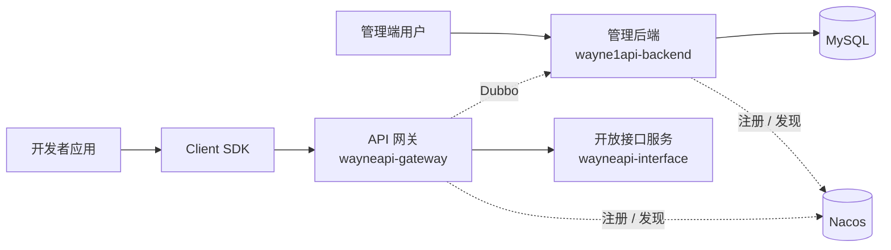
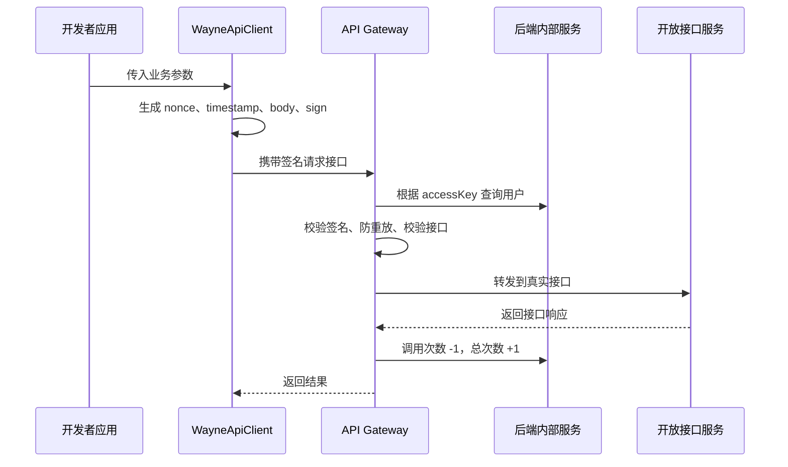

# Wayne API 开放平台

一个面向开发者的 API 开放与调用管理平台。平台提供接口发布、接口调用、用户密钥、网关鉴权、SDK 接入、调用次数统计和热门接口分析等能力，完整模拟了企业开放平台从“接口管理”到“开发者调用”的核心链路。

> 这个项目不是简单的 CRUD 后台，而是围绕 API 开放场景拆出了管理后端、API 网关、开放接口服务、客户端 SDK 和公共服务模块，重点体现分布式调用、网关鉴权、签名认证、调用计量和服务解耦。

## 项目亮点

- **完整的 API 开放平台链路**：支持接口录入、上线、下线、在线调试、开发者调用和调用统计。
- **独立 API 网关鉴权层**：基于 Spring Cloud Gateway 实现统一入口，校验 `accessKey`、`nonce`、`timestamp`、`sign`，并转发到真实接口服务。
- **AK/SK 签名认证机制**：用户注册后分配 `accessKey` / `secretKey`，SDK 通过 SHA-256 生成签名，避免密钥明文传输。
- **客户端 SDK 封装**：提供 `wayneapi-client-sdk`，调用方只需要配置 AK/SK 即可发起接口调用，降低接入成本。
- **Dubbo 内部服务解耦**：网关通过 Dubbo 调用后端内部服务，查询调用用户、接口信息并更新调用次数。
- **接口调用计量**：接口调用成功后自动扣减剩余次数并累计总调用次数，可用于额度控制、计费和运营分析。
- **热门接口分析**：提供 Top 接口统计能力，支持从调用数据中分析接口热度。
- **多模块工程设计**：按管理后端、网关、SDK、公共模块、接口服务拆分职责，结构更接近真实业务系统。

## 技术栈

| 方向 | 技术 |
| --- | --- |
| 后端框架 | Spring Boot 2.7.0 / 2.6.13 |
| 网关 | Spring Cloud Gateway |
| RPC | Apache Dubbo |
| 注册中心 | Nacos |
| 持久层 | MyBatis-Plus、MyBatis |
| 数据库 | MySQL |
| 接口文档 | Knife4j / Swagger |
| 工具库 | Hutool、Gson、Apache Commons Lang3、Lombok |
| 构建工具 | Maven |
| 前端 | React 18、Ant Design Pro、Umi Max、TypeScript、ECharts |

## 系统架构



## 模块说明

| 模块 | 端口 | 说明 |
| --- | --- | --- |
| `wayne1api-backend` | `7529` | 核心管理后端，负责用户、接口、调用关系、统计分析等业务 |
| `wayneapi-gateway` | `8091` | API 网关，负责统一鉴权、接口校验、请求转发和调用统计 |
| `wayneapi-interface` | `8123` | 示例开放接口服务，模拟真实可调用 API |
| `wayneapi-client-sdk` | - | Java 客户端 SDK，封装签名和 HTTP 请求 |
| `wayneapi-common` | - | 公共实体类、VO、Dubbo 内部服务接口 |
| `wayneapi-frontend` | `8000` | 管理端前端，提供登录、接口管理、在线调用、接口分析等页面 |

## 核心业务流程

### 1. 开发者调用接口



### 2. 接口上线

管理员在后端提交接口上线操作后，系统会先校验接口是否存在，再通过 SDK 发起一次测试调用。调用成功后，接口状态更新为上线，开发者才可以通过网关调用。

## 功能清单

| 功能 | 说明 |
| --- | --- |
| 用户注册登录 | 支持账号注册、登录、注销、当前登录用户获取 |
| AK/SK 分配 | 用户注册时自动生成调用凭证 |
| 接口管理 | 支持接口新增、删除、修改、分页查询、上线、下线 |
| 接口在线调用 | 管理端可传入请求参数测试调用接口 |
| 网关鉴权 | 校验 accessKey、nonce、timestamp、sign 和接口合法性 |
| 防重放设计 | 使用 nonce 和 timestamp 降低请求重放风险 |
| 调用统计 | 调用成功后扣减剩余次数并累计总调用次数 |
| 热门接口分析 | 查询调用次数 Top 接口 |
| SDK 接入 | 调用方通过 SDK 配置 AK/SK 后即可请求开放接口 |

## 目录结构

```text
wayne1api-backend
|-- src/                         # 管理后端源码
|-- wayneapi-client-sdk/          # Java SDK
|-- wayneapi-common/              # 公共实体和 Dubbo 接口
|-- wayneapi-gateway/             # API 网关
|-- wayneapi-interface/           # 示例开放接口
|-- wayneapi-frontend/            # React 管理端前端
|-- sql/                          # 数据库脚本
|-- doc/                          # 项目补充文档
|-- AGENTS.md                     # AI / 新成员项目上下文
|-- README.md
```

## 快速开始

### 1. 环境准备

- JDK 8 或 JDK 17
- Maven 3.8+
- MySQL 5.7+ / 8.x
- Nacos 2.x

> 注意：建议使用 JDK 17 或 JDK 8。JDK 21 可能和项目中的旧版 Lombok / Spring Boot 组合产生编译兼容问题。

### 2. 初始化数据库

创建数据库并导入脚本：

```sql
create database if not exists yuapi;
```

然后执行：

```text
sql/ddl.sql
sql/db.sql
```

数据库连接默认配置在：

```text
src/main/resources/application.yml
```

默认连接信息：

```yaml
spring:
  datasource:
    url: jdbc:mysql://localhost:3306/yuapi
    username: root
    password: root
```

### 3. 启动 Nacos

Dubbo 服务注册中心默认地址：

```text
nacos://localhost:8848
```

### 4. 构建模块

当前仓库根 `pom.xml` 不是 Maven 聚合父工程，需要按依赖顺序构建：

```bash
mvn -DskipTests install -f wayneapi-common/pom.xml
mvn -DskipTests install -f wayneapi-client-sdk/pom.xml
mvn -DskipTests compile -f wayneapi-gateway/pom.xml
mvn -DskipTests compile -f wayneapi-interface/pom.xml
mvn -DskipTests compile -f pom.xml
```

### 5. 启动服务

建议启动顺序：

```text
1. MySQL
2. Nacos
3. wayne1api-backend      http://localhost:7529/api
4. wayneapi-interface     http://localhost:8123/api
5. wayneapi-gateway       http://localhost:8091
```

接口文档地址：

```text
http://localhost:7529/api/doc.html
```

### 6. 启动前端

进入前端目录并安装依赖：

```bash
cd wayneapi-frontend
npm install
```

本地开发启动：

```bash
npm run start:dev
```

默认访问地址：

```text
http://localhost:8000
```

前端默认通过后端接口访问 API 管理服务，开发时请先确保管理后端已启动在 `http://localhost:7529/api`。

## SDK 使用示例

在调用方配置 AK/SK：

```yaml
wayneapi:
  client:
    access-key: your-access-key
    secret-key: your-secret-key
```

注入并调用 SDK：

```java
@Resource
private WayneApiClient wayneApiClient;

public String invoke() {
    User user = new User();
    user.setUsername("wayne");
    return wayneApiClient.getUsernameByPost(user);
}
```

SDK 会自动生成请求头：

```text
accessKey: 调用方身份
nonce: 随机数
timestamp: 当前时间戳
body: 请求体
sign: SHA-256(body + "." + secretKey)
```

## 关键接口

| 接口 | 方法 | 说明 |
| --- | --- | --- |
| `/api/user/register` | POST | 用户注册，生成 AK/SK |
| `/api/user/login` | POST | 用户登录 |
| `/api/interfaceInfo/add` | POST | 新增接口 |
| `/api/interfaceInfo/online` | POST | 发布接口 |
| `/api/interfaceInfo/offlinee` | POST | 下线接口 |
| `/api/interfaceInfo/invoke` | POST | 在线调用接口 |
| `/api/userInterfaceInfo/list/page` | GET | 分页查询用户接口调用关系 |
| `/api/analysis/top/interface/invoke` | GET | 查询调用次数 Top 接口 |
| `/api/name/user` | POST | 示例开放接口 |

## 数据模型

| 表 | 说明 |
| --- | --- |
| `user` | 用户信息，包含账号、密码、角色、accessKey、secretKey |
| `interface_info` | 接口信息，包含接口名称、描述、URL、请求方法、状态 |
| `user_interface_info` | 用户接口调用关系，包含剩余次数、总调用次数、状态 |

## 我在项目中的收获

- 理解并落地了 API 开放平台的核心调用链路：接口管理、开发者凭证、SDK 调用、网关鉴权、调用计量。
- 实践了 Spring Cloud Gateway 全局过滤器，在网关层统一处理签名认证、防重放和请求转发。
- 使用 Dubbo 将网关和管理后端解耦，避免网关直接访问业务数据库。
- 抽取独立 SDK，模拟真实开放平台给第三方开发者提供接入工具的方式。
- 通过调用次数统计和 Top 接口分析，把接口调用行为沉淀为可运营的数据。

## 简历描述参考

**Wayne API 开放平台**：基于 Spring Boot、Spring Cloud Gateway、Dubbo、Nacos、MyBatis-Plus 实现的 API 开放平台，包含接口管理、AK/SK 签名鉴权、客户端 SDK、网关转发、调用次数统计和热门接口分析等功能。负责后端核心链路设计与实现，抽取公共模块和 SDK，通过 Dubbo 完成网关与后端服务解耦，并在网关层实现统一鉴权、防重放校验和调用计量。

## 后续优化方向

- 将当前多个 Maven 工程调整为标准父子聚合工程，统一依赖版本和构建流程。
- 将网关白名单、目标接口 Host、AK/SK 规则等配置外置化。
- 增加接口调用失败不扣次数、接口额度充值、限流熔断等能力。
- 增加 Docker Compose，一键启动 MySQL、Nacos、后端、网关和接口服务。
- 补充单元测试和集成测试，提高核心鉴权链路的可靠性。
